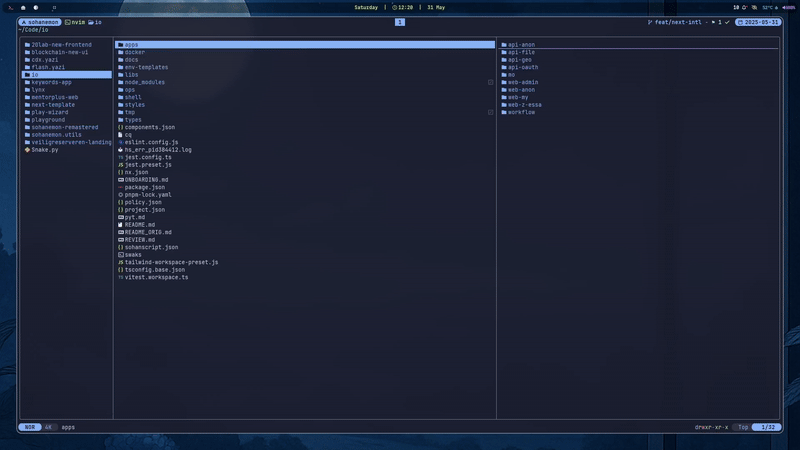

# flash - Jump Navigation Overlay

A [Yazi](https://yazi-rs.github.io/) plugin that enables regex-aware, label-based jumping—heavily inspired by [Flash.nvim](https://github.com/folke/flash.nvim).




## Features

- **Regex & Fuzzy Matching:** Jump to files and folders using plain text or Lua regex.
- **Key-Labeled Overlay:** Quickly navigate with visual labels rendered over matches.
- **Multi-Pane Search:** Matches can appear across parent, current, and preview panes.
- **Statusline Input:** Live typing feedback shown in the status bar.
- **Smart Logic:** Automatically decides whether to jump, reveal, or `cd` based on the match.
- **Customizable:** Toggle features like caps support, auto exit, and single-pane mode.
- **Minimal Dependencies:** Pure Lua and works out of the box.

## Installation

### Git Clone

```sh
git clone https://github.com/sohanemon/flash.yazi ~/.config/yazi/plugins/flash.yazi
````

### Using `ya`

```sh
ya pack -a sohanemon/flash
```

### Using `lazy.nvim` (Requires [Yazi.nvim](https://github.com/mikavilpas/yazi.nvim))

```lua
{
  "sohanemon/flash.yazi",
  lazy = true,
  build = function(plugin)
    require("yazi.plugin").build_plugin(plugin)
  end,
},
```


## Usage

Add keymaps in your `~/.config/yazi/keymap.toml`. For example:

```toml
[manager]
prepend_keymap = [
  { on = ["f"], run = "plugin flash", desc = "Flash Search" },
  { on = ["g", "f"], run = "plugin flash --autocd", desc = "Flash Jump (autocd)" }
]
```

* Press `Space` to switch to Lua regex mode.
* Use `Backspace` to delete characters.
* Press `Enter` to jump to the first match.
* Use label keys to jump directly.
* Press `Esc` to exit at any time.

## Configuration

Optional arguments can be passed when launching the plugin:

| Option         | Type    | Default | Description                                      |
| -------------- | ------- | ------- | ------------------------------------------------ |
| `autocd`       | boolean | false   | Jump into directories instead of revealing them. |
| `only_current` | boolean | false   | Restrict matches to the current pane only.       |
| `show_status`  | boolean | false   | Display typed query in the statusline.           |
| `auto_exit`    | boolean | true    | Quit if no matches are found.                    |
| `enable_caps`  | boolean | false   | Allow uppercase label keys.                      |

Example:

```toml
{ on = ["g", "f"], run = "plugin flash --aautocd --show_status", desc = "Smart Jump" }
```

## Notes

* Labels are drawn using a rotating key set and rendered with custom highlight groups.
* Match behavior respects pane boundaries unless `only_current` is set.
* Hovered files retain default selection highlight unless matched.
* Label and match colors are theme-friendly and adapt to Yazi's style.

## License

MIT © [sohanemon](https://github.com/sohanemon)

